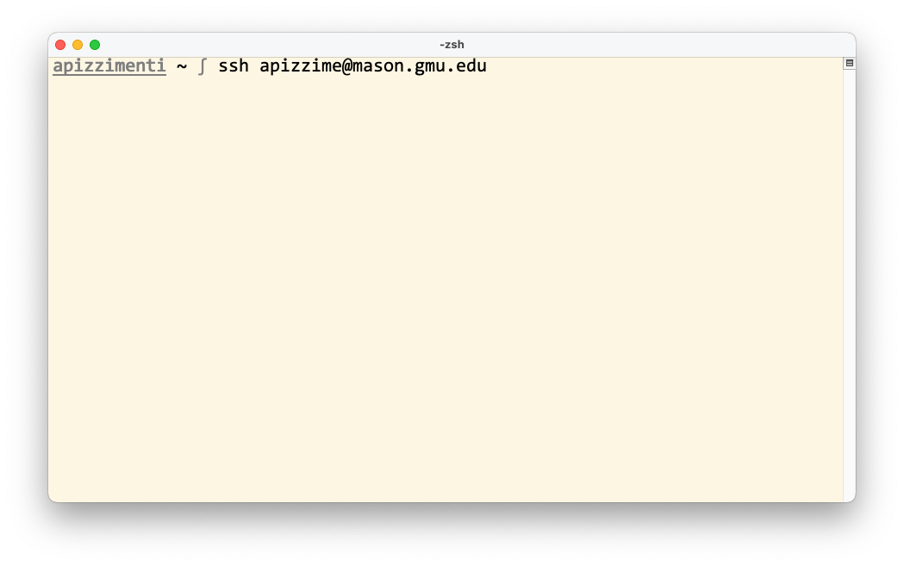
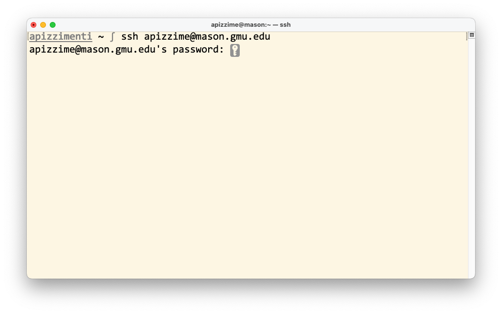
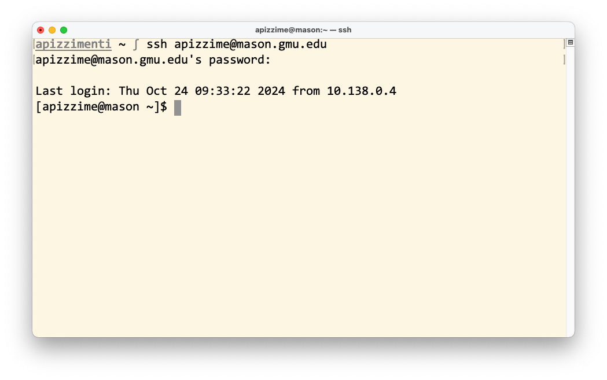
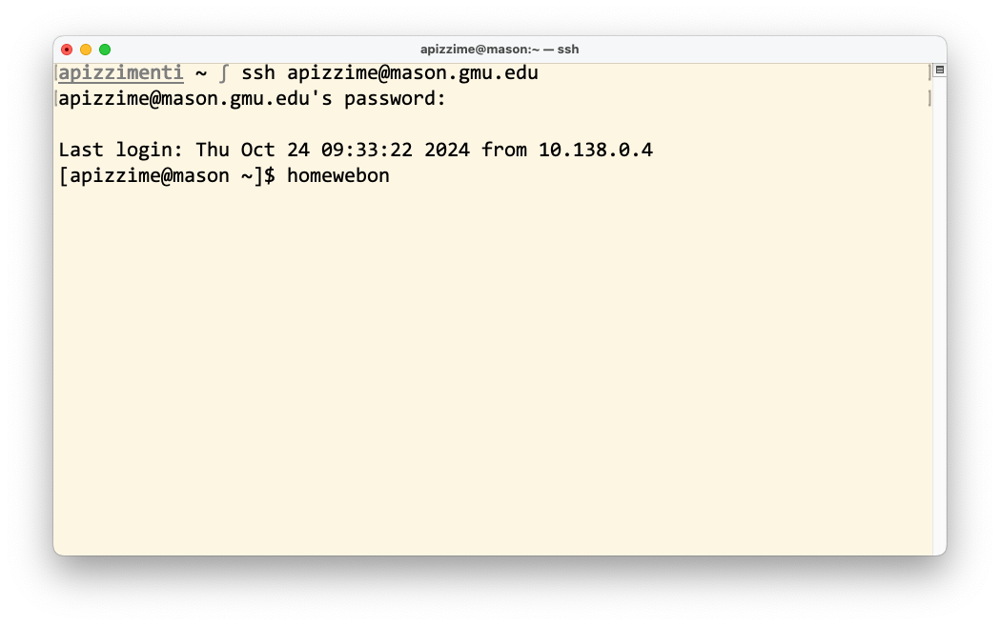
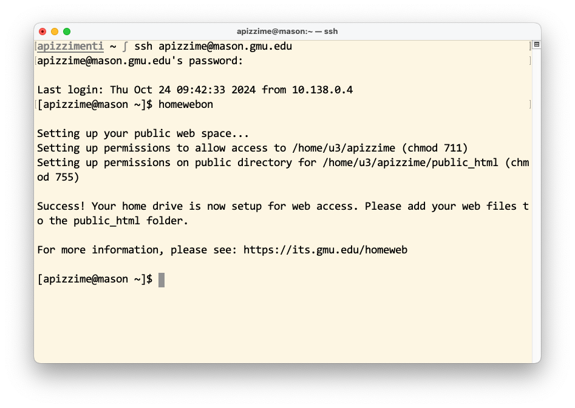
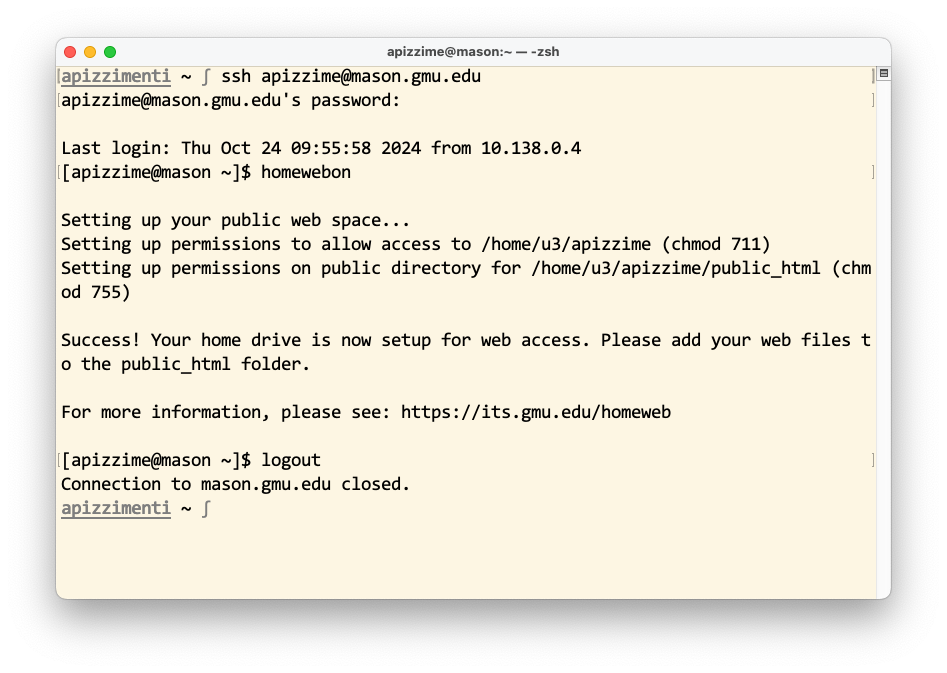

# GMU personal webpage
GMU provides anyone with a `@gmu.edu` email with 100MB of server space to host a personal webpage at no cost.

## Step-by-step instructions. _If you have questions, ask!_
1. Ensure that you have access to your institutional email.
3. Download and install a text/code editor of your choice. I use [Visual Studio Code](https://code.visualstudio.com/), a reasonably lightweight editor with convenient features for any programming language (including Python, MATLAB, C/C++/C#, Wolfram, R, etc.). You'll use the editor to manage your files _locally_.
    - _Note: I suggest installing the [Live Server extension](https://marketplace.visualstudio.com/items?itemName=ritwickdey.LiveServer), which allows you to test your website on your own computer through VSCode_.
4. Download and install a **S**ecure **F**ile **T**ransfer **P**rotocol (SFTP) client:
    - [FileZilla](https://filezilla-project.org/download.php?type=client) for Windows _or_ macOS (_or_ *nix) users;
    - [Forklift 3](https://binarynights.com/) for macOS users _only_.
5. Download and install the [Cisco AnyConnect Secure Mobility Client](https://its.gmu.edu/service/virtual-private-network-vpn/), which allows you to access GMU's **V**irtual **P**rivate **N**etwork (VPN) while off-campus. 
    - _Note: this is also required if you wish to access _any_ GMU resources (e.g. high-performance compute clusters) when not connected to eduroam, MASON-SECURE, or a physical network entry point on campus_.
6. Create a personal web hosting directory on the `mason.gmu.edu` host.
    1. Open a new system command prompt.
        - _For macOS users,_ open a new Terminal prompt: this can be found in the `Applications > Utilities` directory in Finder, or by searching "Terminal" in Spotlight (i.e. hit `⌘ + Space`, then type "Terminal" into the search bar). 
        - _For Windows users,_ open a new PowerShell or Command Prompt prompt: these can be found by searching in the Windows menu.
        - _For Linux users,_ you've probably already used this, but find the Terminal launcher through the Activities menu (by searching "Terminal," "shell," or something similar).

    2. Use the inbuilt **S**ecure **Sh**ell command to access the `mason.gmu.edu` remote host by entering `ssh <your mason id>@mason.gmu.edu`, like  Hit the `return` key once the command is entered.

    3. The remote host will prompt you to enter your Patriot Pass password (the password used for your @gmu.edu email, Blackboard, Canvas, PatriotWeb, etc.).  **When you start typing your password, it will look like no text is being entered into the prompt — but it is!**

    4. A successful login attempt will look like 

    5. Enter the `homewebon` command into the prompt and hit the `return` key. 

    6. The remote host will create a directory — to which _only your account_ has access — at the location printed in the command output. 

    7. To exit the SSH session,
        - close the prompt window, or
        - manually enter the `logout` command, and hit the `return` key. 

7. Once #6 is complete, configure the SFTP client you downloaded in #4 to access the remote web host.
    - The remote hostname is `mason.gmu.edu`.
    - The password is your Patriot Pass password.
    - Access your personal directory by navigating to the location output by `homewebon` (e.g. `/home/u3/apizzime/public_html`).

8. Upload a (possibly blank) file called `index.html` to your `public_html` folder.

9. Your webpage should be live — punch `mason.gmu.edu/~<your mason id>` into your favorite browser to check!
        
8. _(Optional)_ Familiarize yourself with the [basic `git` commands](https://www.atlassian.com/git), and set up a [GitHub account](https://github.com/).
    - _Note: for Windows users, it is possible that `git` is not installed on your computer. [Here's an installation guide](https://github.com/git-guides/install-git)!_
 